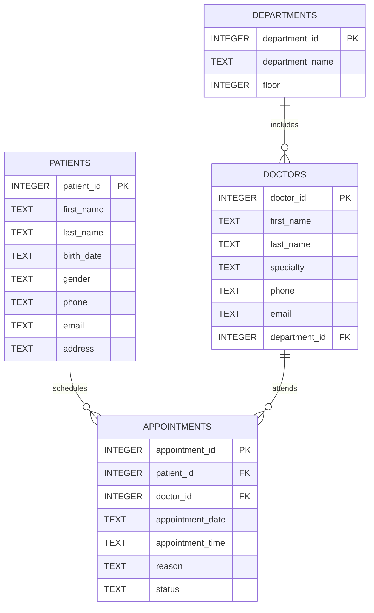

# Hospital Database Management System

A relational hospital database management system developed using **SQLite** and **SQL**.

This project demonstrates the design and implementation of a normalized healthcare database, including patient management, doctors, departments and appointments.

---

## Features

- Relational database design
- Primary & Foreign Keys
- SQL Constraints
- SQL Joins
- Aggregate Queries
- Sample Hospital Dataset
- SQLite Database

---

## Database Structure



The system consists of four main entities:

- Patients
- Doctors
- Departments
- Appointments

Relationships between the tables are implemented using **Foreign Keys**, ensuring data consistency and referential integrity.

---

## Repository Contents

| File | Description |
|------|-------------|
| hospital.db | SQLite database |
| schema.sql | Database schema |
| sample_data.sql | Sample hospital data |
| queries.sql | Example SQL queries |

---

## Example SQL Operations

The project demonstrates:

- INSERT
- SELECT
- JOIN
- GROUP BY
- COUNT
- ORDER BY

Example:

```sql
SELECT
    P.first_name || ' ' || P.last_name AS Patient,
    D.first_name || ' ' || D.last_name AS Doctor,
    D.specialty
FROM Appointments A
JOIN Patients P
ON A.patient_id = P.patient_id
JOIN Doctors D
ON A.doctor_id = D.doctor_id;
```

---

## Technologies

- SQLite
- SQL
- Relational Databases

---

## Learning Outcomes

During this project I practiced:

- Relational Database Design
- SQL Query Development
- Database Normalization
- Foreign Key Relationships
- Data Retrieval using JOIN operations
- Aggregate SQL Functions

---

## Future Improvements

- Laboratory Tests table
- Medical Records table
- Prescriptions table
- Python application for database interaction
- Graphical User Interface

---

## Author

**Konstantinos Tsoumeleas**

B.Sc. Computer Science with Biomedical Applications

University of Thessaly
