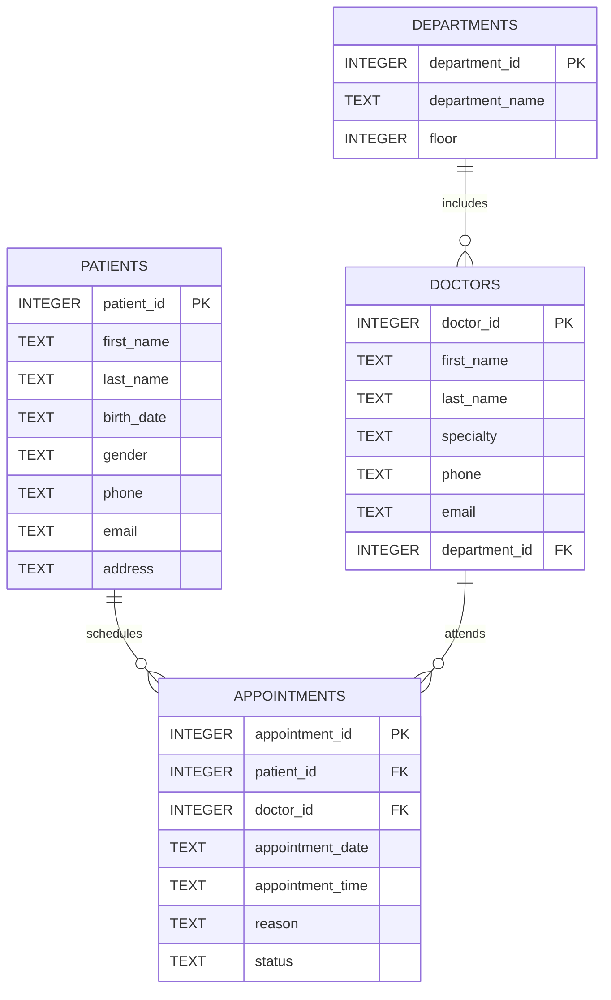

# Hospital Database Management System

A relational hospital database management system developed using **SQLite**, **SQL** and **Python**.

The project demonstrates the design and implementation of a healthcare database for managing patients, doctors, departments and appointments. It also includes a command-line Python application for querying and displaying the stored information.

---

## Features

- Relational database design
- Patient management
- Doctor and department organization
- Appointment scheduling data
- Primary and foreign keys
- Data validation constraints
- SQL `JOIN`, `GROUP BY`, `COUNT` and `ORDER BY` queries
- Patient search by first name or last name
- Hospital statistics
- Python command-line interface
- Sample healthcare dataset

---

## Database Structure

The database consists of four main entities:

- `Patients`
- `Doctors`
- `Departments`
- `Appointments`

The tables are connected through foreign keys to maintain referential integrity.



---

## Table Relationships

- One department can include multiple doctors.
- One patient can have multiple appointments.
- One doctor can attend multiple appointments.
- Each appointment is associated with one patient and one doctor.

---

## Repository Contents

| File | Description |
|---|---|
| `hospital.db` | Ready-to-use SQLite database |
| `schema.sql` | SQL script for creating the database structure |
| `sample_data.sql` | Sample departments, doctors, patients and appointments |
| `queries.sql` | Example SQL queries and reports |
| `python_app.py` | Python command-line application |
| `screenshots/` | Application screenshots |

---

## Example SQL Query

The following query combines data from the `Appointments`, `Patients` and `Doctors` tables:

```sql
SELECT
    P.first_name || ' ' || P.last_name AS Patient,
    D.first_name || ' ' || D.last_name AS Doctor,
    D.specialty,
    A.appointment_date,
    A.appointment_time,
    A.status
FROM Appointments AS A
JOIN Patients AS P
    ON A.patient_id = P.patient_id
JOIN Doctors AS D
    ON A.doctor_id = D.doctor_id
ORDER BY A.appointment_date, A.appointment_time;
```

This transforms numeric identifiers into readable appointment information containing the patient's name, doctor's name, specialty, date, time and appointment status.

---

## Python Application

The Python application connects directly to `hospital.db` using Python's built-in `sqlite3` module.

It provides the following options:

1. View patients
2. View doctors
3. View appointments
4. Search for a patient
5. Show hospital statistics
6. Exit

No external Python packages are required.

---

## Application Preview

### Patient Records

The application retrieves and displays all patient records stored in the SQLite database.


### Doctors and Appointments

The application uses SQL joins to display doctors with their departments and appointments with readable patient and doctor information.


### Patient Search and Statistics

Users can search for patients by first name or last name and view summary statistics for the hospital database.


---

## Sample Statistics

The included sample database contains:

- **10 patients**
- **6 doctors**
- **6 departments**
- **10 appointments**
- **4 completed appointments**
- **6 scheduled appointments**

---

## How to Run the Python Application

### 1. Download the project

Download the repository as a ZIP file and extract it, or clone it using Git:

```bash
git clone https://github.com/kostastsoume/hospital-database-management-system.git
```

### 2. Open a terminal in the project folder

```bash
cd hospital-database-management-system
```

### 3. Run the application

On Windows:

```bash
python python_app.py
```

Alternatively:

```bash
py python_app.py
```

The `python_app.py` and `hospital.db` files must remain in the same folder.

---

## Recreating the Database

The database can also be rebuilt from the SQL scripts.

Using the SQLite command-line tool:

```bash
sqlite3 hospital.db < schema.sql
sqlite3 hospital.db < sample_data.sql
```

Alternatively, open the scripts through **DB Browser for SQLite** and execute them in this order:

1. `schema.sql`
2. `sample_data.sql`

The example queries can then be executed from:

```text
queries.sql
```

---

## Technologies

- Python
- SQLite
- SQL
- DB Browser for SQLite
- Git
- GitHub

---

## SQL Concepts Demonstrated

- `CREATE TABLE`
- Primary keys
- Foreign keys
- `AUTOINCREMENT`
- `NOT NULL`
- `UNIQUE`
- `CHECK`
- Indexes
- `INSERT`
- `SELECT`
- `WHERE`
- `JOIN`
- `GROUP BY`
- `COUNT`
- `ORDER BY`

---

## Learning Outcomes

Through this project, I gained practical experience in:

- Designing a relational healthcare database
- Defining relationships between database entities
- Maintaining data integrity with foreign keys and constraints
- Populating a database with structured sample data
- Retrieving information using SQL joins
- Creating aggregate queries and summary statistics
- Connecting Python to SQLite
- Building a command-line database interface
- Organizing and documenting a database project on GitHub

---

## Future Improvements

- Add laboratory tests
- Add medical records
- Add prescriptions
- Add appointment creation and cancellation through Python
- Add input validation
- Add authentication and user roles
- Build a graphical or web-based interface
- Add automated tests

---

## Academic and Portfolio Context

This project was developed as a personal portfolio project related to **Health IT** and **Biomedical Informatics**, building on my studies in **Computer Science with Biomedical Applications** at the University of Thessaly.

---

## Author

**Konstantinos Tsoumeleas**

B.Sc. in Computer Science with Biomedical Applications  
University of Thessaly
